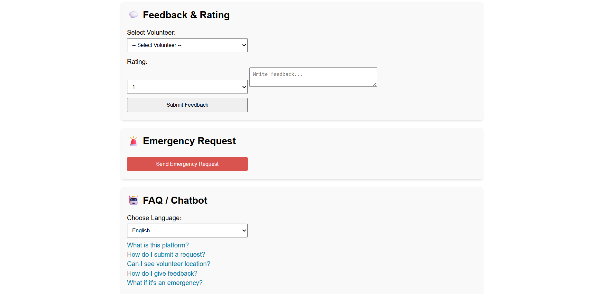
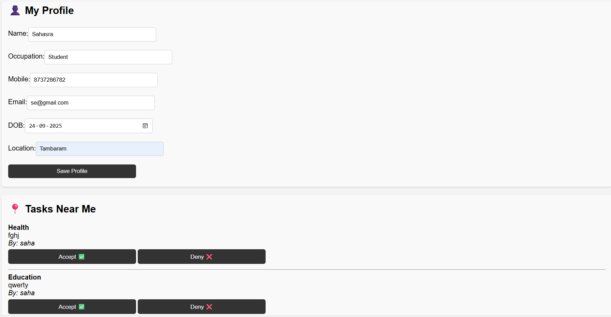

# 🌍 Eco Network
**Tagline:** *Where Help Meets Hope*

Eco Network is a community-driven platform built during a hackathon to connect Help-Seekers with Volunteers.

## ✨ Features
-  Live Request Tracking
-  Integrated Calendar
-  Interactive Map
-  Feedback & Fraud Reporting
-  Emergency Requests
-  Chatbot (Multilingual Option)

##  NGO Task Handling

### Normal Tasks 
- Users are expected to complete standard tasks within **24 hours**.
- Examples: submitting requests, minor community support actions.
- **After 24 hours**, if not completed, NGOs automatically take over to ensure the task is done.

### Emergency Tasks ⚠️
- Urgent issues are prioritized by NGOs immediately.
- Examples: medical emergencies, natural disasters, immediate relief needs.

##  How to Run
1. Clone the repo
2. Open `index.html` in browser
3. Or use Live Server for better experience

## 📸 Screenshots
### Landing Page

### Help-Seeker Dashboard

### Volunteer Dashboard

##  Live Demo
Check out the live project here:  
👉 [Eco Network – Where Help Meets Hope](https://msahasra19.github.io/Eco-Network/)

## 👥 Team
- Sahasra
- Nayani
- Poojitha
- Nakshatra
